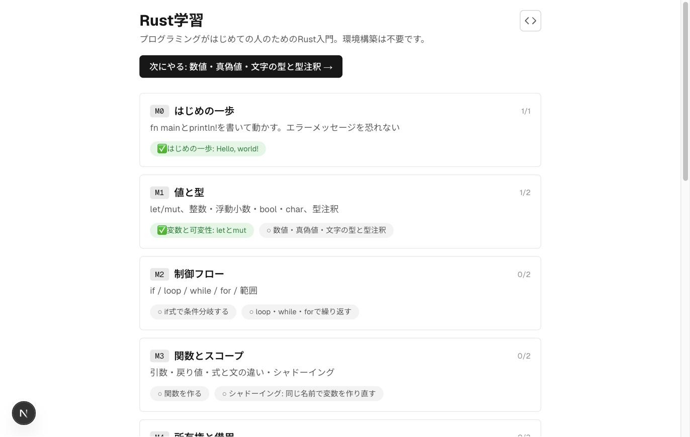
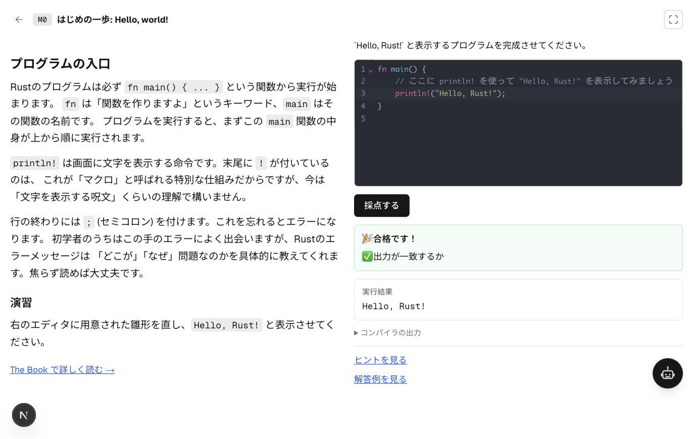
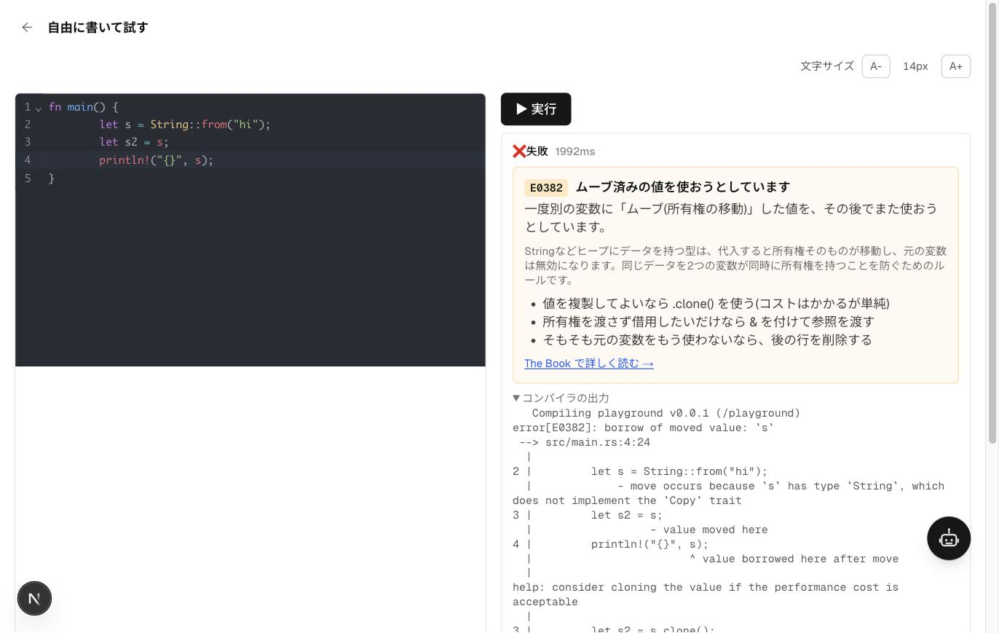

# Rust学習

プログラミングがはじめての人のための、環境構築不要のRust学習Webアプリです。
ブラウザだけで「書く → 実行する → エラーを読む → 直す」のループを回しながら、
`fn main` から簡単なToDo管理CLIを書けるようになるまでを、M0〜M10のマイルストーンで学べます。

## スクリーンショット

|                                            学習マップ                                            |                                              レッスン画面                                              |                                             エラーの日本語解説                                             |
| :------------------------------------------------------------------------------------------: | :------------------------------------------------------------------------------------------------: | :--------------------------------------------------------------------------------------------------: |
|  |  |  |

## 特徴

- **環境構築が不要** — rustup・cargoのインストールなしに、ブラウザだけでRustのコードを書いて実行できます(公式 [Rust Playground](https://play.rust-lang.org/) をサーバ経由で利用)
- **M0〜M10の学習カリキュラム** — 「Hello, world!」から所有権・構造体・トレイト・エラー処理を経て、ToDo管理CLIを書き上げるまでの22レッスン
- **演習の自動採点** — 出力の一致判定や`#[test]`ベースの単体テストで、書いたコードが正しいかその場で確認できます
- **rustcエラーの日本語解説** — `E0382`(ムーブ済みの値)のような初学者がつまずきやすいエラーを、日本語で「何が起きたか」「どう直すか」まで解説します
- **進捗の自動保存** — 完了したレッスンはブラウザの`localStorage`に保存され、次回アクセス時も続きから学習できます
- **自由に書けるPlayground** — レッスンを離れて自由にRustコードを試せる画面も用意しています
- **集中モード** — レッスン画面をエディタ中心の2カラム(左: コード、右: ヒント・解答例・AIチューター)に切り替えて、演習に集中して取り組めます
- **AIチューター(任意)** — ローカルで動くLLM(llama-server等のOpenAI互換API)と接続すると、レッスンの集中モード右パネル・通常モードのドロワー・Playgroundの各画面から質問できます。完成コードは提示せず、考え方やエラーの読み方をヒントとして返す家庭教師役です

## 技術スタック

- [Next.js](https://nextjs.org/) 16 (App Router / Turbopack)
- [React](https://react.dev/) 19
- [TypeScript](https://www.typescriptlang.org/)
- [Tailwind CSS](https://tailwindcss.com/) 4
- [CodeMirror 6](https://codemirror.net/)(`@uiw/react-codemirror`) — コードエディタ
- [Rust Playground API](https://play.rust-lang.org/) — コードの実行基盤

## セットアップ

```bash
npm install
npm run dev
```

[http://localhost:3000](http://localhost:3000) を開くと学習マップが表示されます。

### AIチューターを使う場合

AIチューターは任意機能です。ローカルPCで [llama-server](https://github.com/ggml-org/llama.cpp) など
OpenAI互換の `/v1/chat/completions` を話すサーバを起動しておくと、レッスン画面から質問できるようになります。

```bash
cp .env.local.example .env.local
# 既定値は http://127.0.0.1:8080/v1 (llama-serverの既定ポート)
```

`.env.local` で以下を設定できます。

| 変数 | 説明 | 既定値 |
| --- | --- | --- |
| `TUTOR_BASE_URL` | OpenAI互換APIのベースURL | `http://127.0.0.1:8080/v1` |
| `TUTOR_MODEL` | 使用するモデル名(llama-serverは省略可) | (省略) |

サーバが起動していない場合、AIチューターは接続エラーを表示しますが、採点機能など他の機能には影響しません。

## ディレクトリ構成

```
app/
  page.tsx                  学習マップ(トップページ)
  learn/[lessonId]/         レッスン画面
  playground/               自由記述のPlayground
  api/run/                  コード実行を中継するAPI Route
  api/tutor/                AIチューターへの問い合わせを中継するAPI Route(ストリーミング)
lib/
  runner/                   Rustコード実行の抽象化とPlayground実装
  tutor/                    AIチューターのプロンプト構築とローカルLLMクライアント
  grading.ts                演習の自動採点ロジック
  rustc-errors.ts           rustcエラーコード→日本語解説
  progress.ts               学習進捗(localStorage)
content/
  curriculum.ts             M0〜M10のマイルストーン定義
  lessons/                  各レッスンの本文・演習・採点条件
components/                 UIコンポーネント
components/tutor/           AIチューターのパネル・会話状態・共有コンテキスト
```

## ライセンス

[MIT](LICENSE)
